# Teknisk rapport Caspar

En teknisk rapport för utvecklingen av Glare, en flashcardstjänst. En rapport som jag successivt antecknat i, genom produktens utveckling. Till en början hänvisa jag till githublänkar som markerar kodsnippets som jag utvecklat, dock ganska snabbt insåg jag att koden förändras och utvecklas, vilket resulterade i att länkarna inte uppdaterar korrekt rader kod. Därför har jag gjort all kod "collapsable", så för att se kod behöver du trycka på pilarna. Testa nedan

<details>
<summary>Visa kod: </summary>

```js
function isUserNoob() {
  if (userSeeThis) {
    return false;
  }
  return true;
}
// Snyggt! Nu vet du hur du går till väga resten av rapporten
```

</details>

För att underlätta förståelsen av alla snippets så har jag modifierat koden så den följer samma röda tråd som beskrivningen. Detta för att undvika distraherande kod som kan vilseleda förståelsen av själva funktionalliteten.

## 20/02-25

### fetchCards

Till en allra första början skapade vi en .json fil som hade strukturen vi förväntade oss att jobba med framöver

<details>
<summary>decks.json</summary>

```json
{
  "decks": [
    {
      "title": 1:ans multiplikation,
      "cards": [
        {
          "question":"1 x 1 = ?",
          "answer" : "1"
        },
        ...
      ]
    },
    ...
  ]
}
```

</details>

Som första steg ville jag se ifall jag kunde fetcha information från en .json fil

<details>
<summary> Visa kod för: src/components/FlashCard.vue</summary>

```js
<script setup>
import { ref } from "vue";

async function getDecks() {
  const response = await fetch("/decks.json");
  let data = await response.json();
  decks.value = data;
}

const decks = ref([]);
getDecks();

console.log(decks.value);
</script>

<template>
  <h1>hej från flashcard</h1>
  <ol>
    <li v-for="deck in decks">{{ deck.title }}</li>
  </ol>
</template>
```

</details>

---

## 21/02-25

### revealAnswer

Jag fick idén att hämta kortlek och respektives kort genom att lyssna vilket vika värden som finns i URL:n, så när man skriver "/collection/1/2" i webläsaren ska man komma till andra kortet i kortlek nr 1.
<br>
Det kändes som en bra lösning då det ända man behöver göra senare för att navigera mellan kort är att addera eller subtrahera värdena från urln, plus det ger användaren möjlighet att navigera sig snabbt till en lek genom att spara länkar. Det verkar med andra ord användarvänligt.
<br>
Utmaningen var att kortet skulle lyssna på url:n både vid uppdatering av sidan och när man anger nya värden i urln, detta löste jag med genom att implementera onMounted() och on befoureRouteUpdate()
<br>
Implementerade även en toggle, så när man trycker på space, ska frågan och svar togglas fram och tillbaka, bara för att jag personligen är en keyboard fantast.

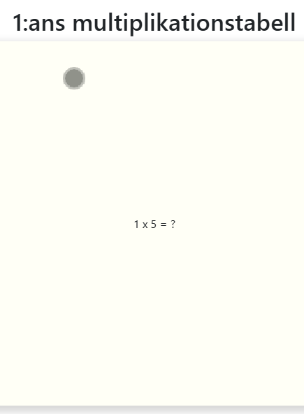

<details>

<summary> Visa kod för: src/components/FlashCard.vue</summary>

```js
function revealAnswer() {
  hideAnswer.value = false;
  console.log("reveal");
}

function handleKeyDown(event) {
  if (event.code === "space" || event.key === " ") {
    revealAnswer();
  }
}

// Update deckId and cardId when page refreshes
onMounted(async () => {
  await getDecks();

  watchEffect(
    () => [route.params.deckId, route.params.cardNr],
    (currentDeck.value = decks.value[route.params.deckId]),
    (currentCard.value = currentDeck.value.cards[route.params.cardNr]),
    console.log(currentDeck.value),
    console.log(currentCard.value)
  );

  // Create eventlistener to any keydown
  window.addEventListener("keydown", handleKeyDown);
});

onBeforeUnmount(() => {
  window.removeEventListener("keydown", handleKeyDown);
});

// Update deckId and cardId when url changes
onBeforeRouteUpdate(async (to, from) => {
  deckId = to.params.deckId;
  cardNr = to.params.cardNr;
  currentDeck.value = decks.value[deckId];
  currentCard.value = currentDeck.value.cards[cardNr];
});
```

</details>

---

### Parprogrammering Zaher

Jag och zaher har tillsammans rätt ut så man kan mata in en deck prop till komponenten CardCollection så att det visas ut en mapp på sidan som leder till motsvarande kortlek. Först tänkte vi mata in :title=title och :count=count men insåg sedan att det räcker med att mata in :deck=deck där deck är ett objekt så får komponenten själv ta fram titeln och räkna ut antalet kort i count.

<details>
<summary> Visa kod för: src/view/CollectionView.vue</summary>

```js
<template>
  <div class="container">
    <!-- <FlashCard /> -->
    <router-link
      :key="deck.id"
      id="nodeco"
      v-for="(deck, index) in decks"
      :to="`/collection/${index + 1}/1`"
    >
      <CardCollection :deck="deck" /> // Notera :deck
    </router-link>
  </div>
</template>

```

</details>

---

## 22/02-25

### Helg refaktorering med pinia 🍍

Istället för att fetcha korten dirrekt i FlashCard.vue så skapade jag en store för all flashcard funktionallitet där jag skapade både decks variabel och fetchCards funktion. Syftet är att man lätt och smitidigt ska kunna sammla alla funktioner som berör flashcards på ett och samma ställe. Utmaningen var att få det asyncrona att jobba för mig. Först skapade jag fetchen i getters, men fick senare svar på att det är inte menat att getters ska vara asynkrona.

<details>
<summary> Visa kod för: src/stores/flashcards.js</summary>

```js
import { defineStore } from "pinia";

export const useFlashcard = defineStore("flashcard", {
  state: () => ({
    decks: []
  }),
  actions: {
    async fetchDecks() {
      const response = await fetch("/decks.json");
      this.decks = await response.json();
    }
  },
  getters: {
    // getters
  }
});
```

</details>

---

## 23/02-25

### Pinia fortsättning

För att i framtiden kunna möjligöra för användaren att skapa egna kort och kortlekar så implementerade jag createCard(title, question, answer) och createDeck(title, decks=[]) och med hjälp av dom fixade jag även en dummydeck som skapar en sammling kortlekar med gångertabellerna 1-10, så vi har data att bygga vår appikation runt.
<br>
<br>
Anledningen till att jag vill generera dummyDeck istället för att modifiera .json filen är för att det blir repetativt arbete att ständigt mata in ny data eller modifiera data. Risken för oregelbunden json objekt blir stor. Så det underlättar att få dummyDecks genererad.

<details>
<summary> Visa kod för: src/stores/flashcards.js</summary>

```js
actions: {
    createCard(title, question = "", answer) {
      return {
        title,
        question,
        answer,
        needsPractice: false,
        id: uuidv4(),
      };
    },
    addToDeck(card, deckId) {
      const deck = this.decks.filter((deck) => deck.id === deckId);
      deck[0].cards.push(card);
    },
    createDeck(title, cards = []) {
      const deck = {
        title,
        cards,
        id: uuidv4(),
      };
      this.decks.push(deck);
      return deck.id;
    },
    /**Genrates multiplication table from 1-12 and adds to this.decks */
    dummyDeck() {
      const tableAmounts = 10;
      const tableLimit = 12;

      for (let x = 1; x <= tableAmounts; x++) {
        const deckTitle = `${x}:ans gånger tabell`;
        const deckId = this.createDeck(deckTitle);

        for (let y = 1; y <= tableLimit; y++) {
          const title = `${x} x ${y} = ?`;
          const answer = x * y;
          const card = this.createCard(title, "", answer);
          this.addToDeck(card, deckId);
        }
      }
      return this.decks;
    },
  }
```

</details>

---

## 24/02-25

### Cardcounter

Jag ville att användaren ska kunna se hur långt in bland sina kort den tagit sig, så idag implementerade jag en cardcounter, väldigt simpel lösning. Utifrån url:n tar sidan fram actuell korlek för att räkna ut hur många kort som finns i kortleken och sätta in det som ett maxvärde i countern, samt hämtar cardIndex från url:n och visar ut vilket index användaren befinner sig på
<br>
<br>
Ett problem jag märkte var att användaren kunde navigera sig ur kortlekens max-kortantal. Så med hjälp av if conditions kollade jag så användaren höll sig inom kortlekens längd. knapparna ska inte navigera över eller för under kortantal.

<details>
<summary> Visa kod för: src/view/CollectionView.vue</summary>

```js
// script

// Variables for count
const cardIndex = ref(0);
const cardAmount = ref(0);

watchEffect(
  () => [route.params.deckId, route.params.cardNr],
  updateCurrentCard(route.params.deckId - 1, route.params.cardNr - 1),
);

function updateCurrentCard(deckId, cardIndex) {
  currentDeck.value = flashcard.decks[deckId];
  currentCard.value = currentDeck.value.cards[cardIndex];
  updateCount(flashcard.decks[deckId], cardIndex);
}

function updateCount(deck, cardNumber) {
  cardAmount.value = deck.cards.length;
  cardIndex.value = cardNumber + 1;
}

// template
<div v-if="hideAnswer" class="card" id="front">
  {{ currentCard.question }}
  <span id="count">{{ cardIndex }}/{{ cardAmount }}</span>
</div>
```

</details>

---

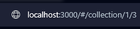

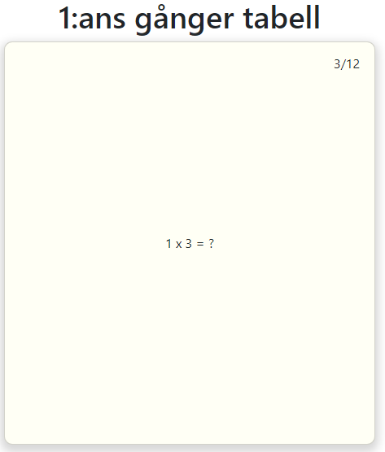

## 25/02-25

### Utmanande framgång

Jag tyckte min kod var rätt så elegant och smart som lösning för hantering av våra flashcardsfunktioner, dock insåg jag sen att det blev en krock med teamet iochmed att dom inte suttit sig in i pinia på samma nivå. Så där blev det utmanande att integrera kod med varrandra. Som lösning på det skapade jag en .json fil för dummyjson så lagmedlemmarna kunde berabeta den som om det vore en api fetch. Där jag basicly kompierade objectet som dummyDeck() spottatde ut och klistrade in i en .json fil.

### Navigering inom korlek

Simon lade till pilarna som console loggade (previous) och (next), Jag och Zaher parprogrammerade fram funtionalliteten till pilarna så dom rör användaren bak eller fram i den aktuella kortleken. Eftersom jag tidigare designat att det är url:n som bestämmer vilket kort som ska visas var det väldigt enkelt att komma på en lösning, det var bara att plussa på eller subdrahera kort indexet i url:n för att navigera framm eller tillbaks.

<details>
<summary> Visa kod för: src/view/CardView.vue</summary>

```js
<script setup>

function goPrevious() {
  if (cardNr.value > 1) {
    cardNr.value--;
  }
}

function goNext() {
  const cardAmount = currentDeck.value.cards.length
  if (cardNr.value < cardAmount) {
    cardNr.value++;
  }
}

</script>


<template>
  <div class="flashcard">
    <router-link :to="`${cardNr}`">
      <button class="arrow" @click="goPrevious">⬅️</button>
    </router-link>

    <FlashCard @on-deck-update="updateDeck" />
    <router-link :to="`${cardNr}`">
      <button class="arrow" @click="goNext">➡️</button>
    </router-link>
  </div>
</template>
```

</details>

---

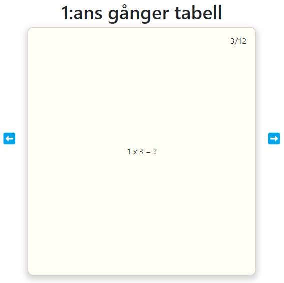

### Avslöjar svar för tidigt bugg

Efter att ha löst navigering mellan kort dök det upp en bugg. När användaren visar svaret så syns svaret och när man då byter till nästa kort så förväntas det att man får en ny fråga. Men då dök nästa kort upp med svaret uppåt istället för frågan, detta berodde på att variablen hideAnswer=false ej ändrades tillbaka till true vid kortnavigation. Efter mycket om och men kom jag fram till en pinsamt enkel lösning.
Så fort url:n uppdateras ska hideAnswer sättas till true.

<details>
<summary> Visa kod för: src/components/FlashCard.vue</summary>

```js
// Update deckId and cardId when url changes
onBeforeRouteUpdate(async (to, from) => {
  // Hides answer when player press next or previous button
  hideAnswer.value = true;

  const deckId = to.params.deckId - 1;
  const cardNr = to.params.cardNr - 1;
  updateCurrentCard(deckId, cardNr);

  // Send current deck to parrent
  emit("on-deck-update", currentDeck.value);
});
```

</details>

---

## 26/02-25

### Svars-indikator

Vi kom fram till att användaren ska kunna se sin statestik när alla svar är besvarade. Så vi behövde ett sätt för användaren att kunna få en tydlig överblick över vilka kort den svarat på och om användaren svarat rätt/fel. Så kom på iden att skapa lika många prickar som antal kort i leken. pricken är grå om kortet saknar svar och röd eller grön om den är besvarad. Alltså får ingen prick vara grå för att användaren ska få se sin statestik.

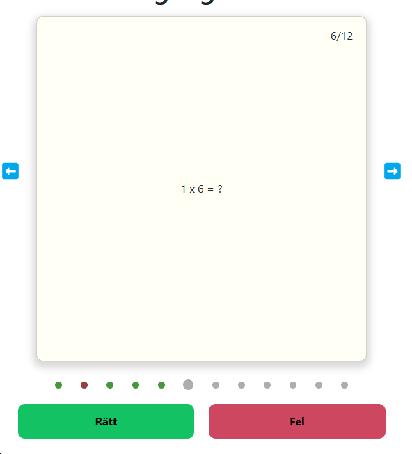

Utmaningen var att ge den aktuella "pricken" correkt css, antingen ska den vara:

- Röd [Om man svarat fel]
- Grön [Om man svarat rätt]
- Grå [Om man inte svarat alls]
- Stor [På den prick som har samma index som det kort man befinner sig på]

Detta löste jag med hjälp av funktionen dotStyle(currentCard) som kollar av de olika vilkoren av akuella kortet som har boolean värden hasAnswer och needsPractice.
Slutningsvis skapar den en sträng som består av de css classer pricken ska ha.

<details>
<summary> Visa kod för: src/view/CardView.vue</summary>

```js
// Script
function dotStyle(currentCard) {
  const cardIndex = 1 + currentDeck.value.cards.indexOf(currentCard);
  let styleSettings = "dot ";
  watchEffect(() => {
    const cardNr = parseInt(route.params.cardNr);
    if (cardIndex === cardNr) {
      styleSettings += "current ";
    }
  });
  if (currentCard.hasAnswer && !currentCard.needsPractice) {
    styleSettings += "correct ";
  } else if (currentCard.hasAnswer && currentCard.needsPractice) {
    styleSettings += "wrong ";
  }
  return styleSettings;
}

// Template
<div id="answer-indicator">
  <div
    v-for="(card) in currentDeck.cards"
    :key="card.id"
    :class="dotStyle(card)"
  />
</div>

// style
.dot {
  height: 10px;
  width: 10px;
  background-color: #adadad;
  border-radius: 100px;
}

.current {
  width: 15px;
  height: 15px;
}
.correct {
  /* background-color: #47973e; */
  background-color: var(--success);
}
.wrong {
  background-color: #973e3e;
  background-color: var(--danger);
}

```

</details>

---

## 01 - 03/03-25 - Statistik sida

### Statistik sida

Vi vill ha en sida där användaren kan få en överblick över användarens prestation utvecklats tack vare vår flashcard tjänst. Målet är att sidan ska göra det motiverande för användaren att fortsätta träna tills kunskapen sitter.
<br>
Största utmaningen här var att veta vad för statistik som är relevant för användaren, och att få allting responsivt och se bra ut på telefon och desktop. är 90% nöjd.
<br>
Jag insåg att när jag var klar med allt så kände jag att det saknades något. Ett sätt att från denna sida ta sig till respektive kortlek och starta en session. Iochmed att jag inte haft med det i kalkylen, hade jag svårt att bestämma mig för vart jag skulle placera en sån knapp eller länk. Så den trycktes mest in där den fick plats. Det jag kunde gjort bättre var att bygga sidan mer skalbar, så den inte är lika känslig ifall man skulle vilja lägga till saker i efterhand.
<br>
<br>
Elin ansvarar för knapparnas funktionallitet, innan dom är klara så måste jag simulera en användares olika "tränings sessioner" så jag skissade först upp vad jag vill att användaren ska se på sidan, sen skapade jag funktioner som genererar dummy data så jag har någonting att bygga runt. I framtiden kommer sessioner skapas för varje gång en användare genomfört en kort träning.
<br>
Innan jag går in på kod, kommer en treat på den färdiga statistics sidan

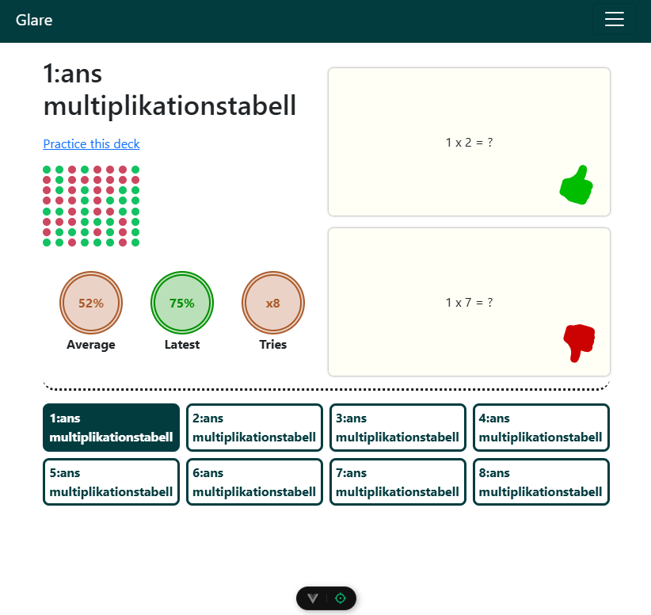

### Det vi ser på sidan är

- Kortlekens titel
- En dirrektlänk till kortlek ifall man vill öva dirrekt.
- Ett prickdiagram som visar en historisk överblick för 10 senast sessioner
- Totala genomsnittet, senaste sessionens genomsnitt och antal gånger man tränat. Färgen baseras på hur höga siffrorna är och går från rött, gult, grönt
- Ett av det korten vi har lättast för, och ett av de kort vi har svårast för, dessa tas fram genom att jämföra de två senaste sessionerna och om man svarat rätt två gånger per rad så utnämns det kortet som ett kort man kan, vise versa för det kort man har problem med, svara fel två gånger per rad anses det vara ett kort man har extra problem med
- Lista på alla kortlekar man har sparade så man smidigt kan navigera och få överblicka de lekar man vill.

---

### Kod som simulerar data

dummySessions, sessionRange och cardRange är nya variabler. Detta för att smidigt kunna tweaka data för att debugga beroende på hur mycket data som finns etc, tex hur löser jag responsiviteten för en användare som skapar 20+ sessioner jämfört med en som bara har 2 sessioner.
<br>
Det var utmamande att lista ut hur man sparar data för att kunna ta fram statistiken. Jag kom fram till att det bästa vore om man kan spara en session som en "snapshot" som index i en array, sen utifrån alla session arrayer jämföra dom med varrandra för att få fram önskad information.

<details>
<summary> Visa kod för: src/stores/flashcards.js</summary>

### Debug variabler för flashcards.js

```js
state: () => ({
    /** The global variable that contains all current user decks*/
    decks: [],
    dummySessions: true, // fill sessions with dummysessions
    sessionsRange: { start: 5, end: 20 }, // generates between start to end amounts of sessions
    cardRange: { start: 5, end: 20 } // generates between start to end amounts of cards when creating deck
  }),
```

### createDeck(title, cards)

Jag valde att spara kortlekens sessioner tillsammans med kortleken i nyckeln "stats", där sessions kommer innehålla korlekens historiska sessioner

```js
/** Creates a deck from array of cards with title
     * @param {String} title The name of the deck
     * @param {Array} cards Array of card objects
     * @returns deck object.
     */
    createDeck(title, cards = []) {
      const deck = {
        title,
        cards,
        id: uuidv4(),
        stats: {
          average: 0, // Total average score 1-100%
          mastered: null, // mastered cards
          practice: null, // cards need practice
          latest: 0, // latest score 1-100%
          practiceAmount: 0, // total practice amount
          sessions: [] // use sessions data to declare rest of stats
        }
      };
      // this.decks.push(deck);
      return deck;
    }

```

### fillDummyData(deck)

Tar emot en befintlig kortlek och börjar med att fylla ut **deck.stats.sessions** med slumpmässig data.
Resterande funktioner är baserade på att sessions innehåller data. Mer om de längre fram.

```js
/** fill deck.stats with information using stats.sessions data
 * @param {Object} deck deck object from createDeck()
 */
fillDummyData(deck) {
  this.fillDummySessions(
    deck,
    this.random(this.sessionsRange.start, this.sessionsRange.end)
  );
  deck.stats.practice = this.getFlashcardsByStatus(deck, "practice");
  deck.stats.mastered = this.getFlashcardsByStatus(deck, "mastered");
  deck.stats.practiceAmount = deck.stats.sessions.length;
  deck.stats.latest = this.getSessionAverage(
    deck.stats.sessions.slice(-1)[0] // Get average from last session
  );
  deck.stats.average = this.getTotalAverage(deck.stats.sessions);
}

```

### fillDummySession(deck)

Tar emot en lek och ett amount värde. Här går jag igenom varje kort och gör att:

- needsPractive = true 25% av svaren och true 75%
- hasAnswer = true (eftersom det krävs att alla frågor har ett svar för att kunna skapa en session)

```js
/** Fill deck.stat.sessions with given amount of random sessions
 * @param {Object} deck deck object from createDeck()
 * @param {Number} amount amount of dummy session to generate
 */
fillDummySessions(deck, amount) {
  const cards = deck.cards;
  let sessions = [];
  for (let index = 0; index < amount; index++) {
    let session = [];
    for (const card of cards) {
      const cardCopy = { ...card }; // duplicate card, otherwise all sessions ends up looking the same
      cardCopy.hasAnswer = true;
      // 25% to answer wrong
      cardCopy.needsPractice =
        Math.floor(Math.random() * 4) + 1 === 1 ? true : false;
      session.push(cardCopy);
    }
    sessions.push(session);
  }
  deck.stats.sessions = sessions;
}
```

### getFlashcardsByStatus(deck)

Spottar ut kort som antingen är bemästrade eller behöver övning. Från början skapade jag två sepparata funktioner för detta ändamål, men insåg att koden ser exakt likadan ut, så bakade in ett vilkor som avgör vilket funktionen spottar ut.

Funktionen jämför de två senaste sessioner (standardsiffra) och kollar om det finns en streak i någon form, om korten fick samma svar så sparas de i en array och skickas ut.

```js
/** Returns either the cards that needs practice or cards that are masterd from latest sessions
 *
 * @param {Object} deck from createDeck()
 * @param {String} status practice / mastered
 * @param {Number} latestSessionAmount if latestSessionAmount = 2 it will only compare the last two sessions
 * @returns Card array of either mastered or cards that needs practice
 */
getFlashcardsByStatus(deck, status = "practice", latestSessionAmount = 2) {
  // Fill masteredCardIds with all card ids, then remove id if card dont need pracice
  let flashcardIds = deck.cards.map((card) => card.id);
  for (const session of deck.stats.sessions.slice(
    latestSessionAmount * -1
  )) {
    for (const card of session) {
      if (status === "practice") {
        if (!card.needsPractice) {
          flashcardIds = flashcardIds.filter((id) => id != card.id);
        }
      } else if (status === "mastered") {
        if (card.needsPractice) {
          flashcardIds = flashcardIds.filter((id) => id != card.id);
        }
      } else {
        throw new Error(
          `status has to be either practice or mastered not: ${status} `
        );
      }
    }
  }

  flashcardIds = new Set(flashcardIds); // Remove duplicate ids
  // retrive cards with ids from needsPractice
  let filteredCards = [];

  // save cards with ids from masteredCardIds to array
  Array.from(flashcardIds).map((id) => {
    deck.cards.filter((card) => {
      if (card.id === id) {
        filteredCards.push(card);
      }
    });
  });

  return filteredCards;
}

```

### getSessionAverage(deck)

Tar fram genomsnittsvärdet en specifik sessione och retunerar det som ett procentvärde. Jag gjorde funktionen för att jag sen ska kunna iterera genom alla sessioner och använda denna funktion för att få det totala snittvärdet.

```js
/**Get sessions average score
 *
 * @param {Array} session array of cards with data from a session
 * @returns average precentage score from session
 */
getSessionAverage(session) {
  let questions = session.length;
  let score = 0;
  session.forEach((card) => {
    score += card.needsPractice ? 0 : 1;
  });
  let average = (score / questions) * 100;
  return average.toFixed();
}

```

### getTotalAverage(deck)

Här använder jag mig av getSessionAverage för att räkna samman kortlekens totala snittvärde.

```js
/** Get total average score from multiple sessions
 *
 * @param {Array} sessions Array containng multiple sessions
 * @returns average precentage score from all sessions
 */
getTotalAverage(sessions) {
  let score = 0;
  for (const session of sessions) {
    score += Number(this.getSessionAverage(session));
  }
  return (score / sessions.length).toFixed();
}

```

</details>

---

### StatisticsView.vue

StatisticsView inehåller:

- En komponent för kortlekens statestik, därför skickar jag in en kortlek som en prop
- Lista över alla korlekar som finns
<details>
<summary> Visa kod för: src/view/StatisticsView.vue</summary>

```js
// Script
<script setup>
  import { useFlashcard } from "../stores/flashcards";
  import { ref, watch } from "vue";
  import { useRoute } from "vue-router";
  import DeckStats from "../components/DeckStats.vue";

  const flashcard = useFlashcard();
  const decks = ref(flashcard.decks);
  const route = useRoute();
</script>

// Template
template>
  <main>
    <!-- Picks deck from decks array by targeting index retrived from url (route.params.deckId) -->
    <DeckStats :deck="flashcard.decks[route.params.deckId - 1]" />
    <ul>
      <!-- Links to targeted deck by directing to decks index from url -->
      <router-link
        class="nodeco"
        v-for="deck in decks"
        :key="deck.id"
        :to="'/statistics/' + Number(decks.indexOf(deck) + 1)"
      >
        <li>{{ deck.title }}</li>
      </router-link>
    </ul>
  </main>
</template>

```

</details>

---

### DeckStats.vue

DeckStats har ett gridsystem som inehåller:

- Title
  - Kortleks titeln
  - Länk till kortlek
  - prickgraph
- Info
  - average
  - latest average
  - practice amount
- Cards
  - kort som bemästrats (om finns)
  - kort som är extra utmanande (om finns)

Jag ville att info värderna skulle infinna sig i en cirkel där bordern och textfärgen är samma färg och bakgrundsfärgen är samma färg men med en opacity på 27%. Men färgerna ska varierar beroende på prestanda

- Average | rött < 50; gult < 75 grönt +75
- Latest average | rött < 50; gult < 75 grönt +75
- Times | rött < 5; gult < 10 grönt + 10
  Jag löste detta med hjälp av css variabler som jag sen med v-bind kunde manipulera, vilket syns senare i template

<details>
<summary > visa .stat i components/DeckStats.vue</summary >

```css
.stat {
  /* class for statistic info (average, latest average, times) */
  /* Standard color are yellow, change rbg with :style="" in element to set customised color */
  --r: 172;
  --b: 91;
  --g: 44;
  --color: rgb(var(--r), var(--b), var(--g));
  --color-o: rgb(var(--r), var(--b), var(--g), 27%);
  padding: 0;
  margin: 0;
  grid-area: stat;
  font-weight: bold;
  display: flex;
  justify-content: center;
  align-items: center;
  width: clamp(13vw, 5em, 6em);
  height: clamp(13vw, 13vw, 15px);
  background-color: var(--color-o);
  border: double 0.4em var(--color);
  color: var(--color);
  border-radius: 1000px;
}
```

</details>

---

### Script och template

- I script har jag deklarerat färger som .stats sen ska stilsättas med beroende på värde.
- Template inehåller ritar ut allt med hjälp av dummy datan som genererats i flashcard.js

<details>
<summary> Visa script och template för: src/components/DeckStats.vue.vue</summary>

```js
// Script
<script setup>
  import { useFlashcard } from "../stores/flashcards";
  import { defineProps, ref, watch } from "vue";
  import { useRoute } from "vue-router";
  const flashcard = useFlashcard();

  // css variables r, b, g to give stat circles color depending on stat score
  const red = ref({ "--r": 175, "--b": 1, "--g": 1 });
  const green = ref({ "--r": 0, "--b": 143, "--g": 0 });
  const yellow = ref({ "--r": 0, "--b": 143, "--g": 0 });
  const route = useRoute();

  const sessions = ref();

  const props = defineProps({
    deck: {
      required: true,
      type: Object
    }
  });

  // Let dot graph max show 10 latest sessions
  let dotsGraph =
    props.deck.stats.sessions.length < 10
      ? props.deck.stats.sessions
      : props.deck.stats.sessions.slice(-10);

  // Update dotgraph to current decks sessions when url changes
  watch(
    () => route.params.deckId,
    (newId, oldId) => {
      sessions.value = flashcard.decks[newId - 1].stats.sessions;
      // Let dot graph max show 10 latest sessions
      dotsGraph =
        sessions.value.length < 10 ? sessions.value : sessions.value.slice(-10);
    }
  );
</script>

// Template
<template>
  <section>
    <div id="title">
      <h1>
        {{ deck.title }}
      </h1>
      <router-link
        id="practice-link"
        :to="`/collection/${route.params.deckId}/1`"
        >Practice this deck</router-link
      >
      <!-- Draws out all sesssion history where a card answer represent a dot red or green  -->
      <div id="dots-container" v-if="deck.stats.sessions">
        <p v-if="!deck.stats.sessions[0]">Study this deck to gather data</p>
        <ul v-for="session in dotsGraph" :key="session.id" class="dots">
          <li v-for="card in session" :key="card.id">
            <div v-if="card.hasAnswer && card.needsPractice" class="dot red" />
            <div
              v-else-if="card.hasAnswer && !card.needsPractice"
              class="dot green"
            />
            <div v-else class="dot grey" />
          </li>
        </ul>
      </div>
    </div>
    <!-- Displays three circles average, latest session and amount of tries,
     circles color turns either red, yellow or green depending on score-->

    <div id="info">
      <ul v-if="deck.stats.sessions[0]">
        <!-- Average: red when score < 50, yellow: score < 75, else green -->
        <li>
          <p class="stat-title">Average</p>
          <p class="stat" v-if="deck.stats.average < 50" :style="red">
            {{ deck.stats.average }}%
          </p>
          <p class="stat" v-else-if="deck.stats.average >= 75" :style="green">
            {{ deck.stats.average }}%
          </p>
          <p class="stat" v-else>{{ deck.stats.average }}%</p>
        </li>

        <!-- Latest session score: red when score < 50, yellow: score < 75, else green -->
        <li>
          <p class="stat-title">Latest</p>
          <p class="stat" v-if="deck.stats.latest < 50" :style="red">
            {{ deck.stats.latest }}%
          </p>
          <p class="stat" v-else-if="deck.stats.latest >= 75" :style="green">
            {{ deck.stats.latest }}%
          </p>
          <p class="stat" v-else>{{ deck.stats.latest }}%</p>
        </li>

        <!-- Tries: red when score < 5, yellow: score < 10, else green -->
        <li>
          <p class="stat-title">Tries</p>
          <p class="stat" v-if="deck.stats.practiceAmount < 5" :style="red">
            x{{ deck.stats.practiceAmount }}
          </p>
          <p
            class="stat"
            v-else-if="deck.stats.practiceAmount > 10"
            :style="green"
          >
            x{{ deck.stats.practiceAmount }}
          </p>
          <p class="stat" v-else>x{{ deck.stats.practiceAmount }}</p>
        </li>
      </ul>
    </div>
    <!-- Displays one of players mastered card one of players toughest card -->
    <div id="cards" v-if="deck.stats.sessions[0]">
      <div class="card" v-if="deck.stats.mastered[0]">
        {{ deck.stats.mastered[0].question }}
        <svg
          xmlns="http://www.w3.org/2000/svg"
          width="50"
          height="50"
          fill="currentColor"
          class="bi bi-hand-thumbs-up-fill stamp thumbs-up"
          viewBox="0 0 16 16"
        >
          <path
            d="M6.956 1.745C7.021.81 7.908.087 8.864.325l.261.066c.463.116.874.456 1.012.965.22.816.533 2.511.062 4.51a10 10 0 0 1 .443-.051c.713-.065 1.669-.072 2.516.21.518.173.994.681 1.2 1.273.184.532.16 1.162-.234 1.733q.086.18.138.363c.077.27.113.567.113.856s-.036.586-.113.856c-.039.135-.09.273-.16.404.169.387.107.819-.003 1.148a3.2 3.2 0 0 1-.488.901c.054.152.076.312.076.465 0 .305-.089.625-.253.912C13.1 15.522 12.437 16 11.5 16H8c-.605 0-1.07-.081-1.466-.218a4.8 4.8 0 0 1-.97-.484l-.048-.03c-.504-.307-.999-.609-2.068-.722C2.682 14.464 2 13.846 2 13V9c0-.85.685-1.432 1.357-1.615.849-.232 1.574-.787 2.132-1.41.56-.627.914-1.28 1.039-1.639.199-.575.356-1.539.428-2.59z"
          />
        </svg>
      </div>
      <div class="card" v-if="deck.stats.practice[0]">
        {{ deck.stats.practice[0].question }}
        <svg
          xmlns="http://www.w3.org/2000/svg"
          width="50"
          height="50"
          fill="currentColor"
          class="bi bi-hand-thumbs-down-fill stamp thumbs-down"
          viewBox="0 0 16 16"
        >
          <path
            d="M6.956 14.534c.065.936.952 1.659 1.908 1.42l.261-.065a1.38 1.38 0 0 0 1.012-.965c.22-.816.533-2.512.062-4.51q.205.03.443.051c.713.065 1.669.071 2.516-.211.518-.173.994-.68 1.2-1.272a1.9 1.9 0 0 0-.234-1.734c.058-.118.103-.242.138-.362.077-.27.113-.568.113-.856 0-.29-.036-.586-.113-.857a2 2 0 0 0-.16-.403c.169-.387.107-.82-.003-1.149a3.2 3.2 0 0 0-.488-.9c.054-.153.076-.313.076-.465a1.86 1.86 0 0 0-.253-.912C13.1.757 12.437.28 11.5.28H8c-.605 0-1.07.08-1.466.217a4.8 4.8 0 0 0-.97.485l-.048.029c-.504.308-.999.61-2.068.723C2.682 1.815 2 2.434 2 3.279v4c0 .851.685 1.433 1.357 1.616.849.232 1.574.787 2.132 1.41.56.626.914 1.28 1.039 1.638.199.575.356 1.54.428 2.591"
          />
        </svg>
      </div>
    </div>
  </section>
</template>

```

</details>

---

## 05-06/03-25

### Knappfunktionallitet parprogrammering med Elin

Vi vill att när knapparna ska göra att aktuellt kort får atributet hasAnswer = true när en knapp klickas och beroende på om man svarat rätt eller fel får needsPractice = true/false. Detta för att vi ska kunna spara sessionens statistik när alla kort är besvarade.

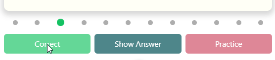

Elin har krigat länge med dessa knappar men stött på en märklig grej. Hur hon än gjorde så kunde dök inte frågan upp på flashcardet. Hon trodde att det var kod som hon gjort som orsakat detta, men hur mycket hon än ändrade sin kod fram och tillbaks gick det inte.. Fram tills vi parprogrammerade, då insåg jag att hon har en gammal localstorage som sidan hämtar information från, den ger svaret i form av card.title, men det ändrade vi ganska tidigt till card.question. Så hon hade alltså missat att rensa localstorage för att få det nya genererade cards objektet.
<br>
<br>
Knapparnas funktionallitet satt vi på varsin ände och försökte lösa. Efter ett tag var jag tvungen att pysa iväg och när jag kom tillbaka så var de fixade, så den delen löste hon.

---

### Exportera till statistik

Tack vare att knapparna nu fungerar kan jag känna av ifall alla kort är svarade och om de är det så ska **deck.cards** exporteras till **deck.stats.sessions**.
<br>
<br>
Där **deck.cards** är en array med alla kort och sessions är en array som inehåller snapshots av korten och vad de hade för värde efter att användaren gissat rätt/fel per kort.

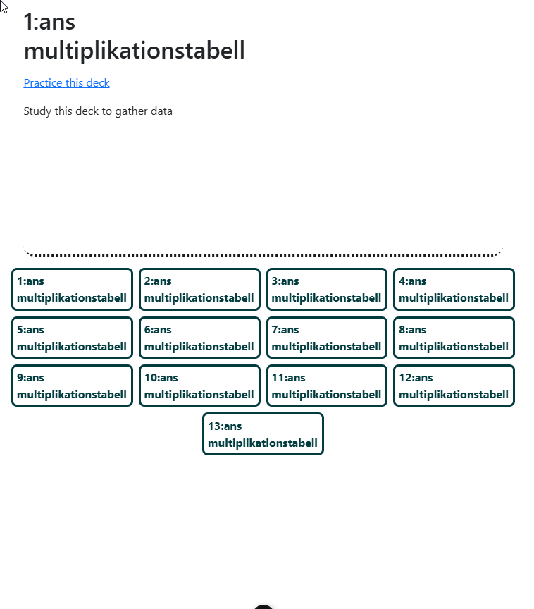

**Notera att först finns ingen statistik för 1:ans gångertabell, men när alla kort har ett svar så exporteras statistiken och alla korts data återställs (går från färgade till gråa ögonblicket sista frågan är besvarad)**

<details>
<summary> Visa kod för: src/view/CardView.vue</summary>

### allIsAnswered()

När denna funktion kallas går den igenom alla kort för att se om de är besvarade, skulle det vara så att minst ett är obesvarat så ändras variablen allIsAnswer till false. En miss jag gjorde i början var att retunera false i foreach loopen, men efter som att foreach är en funktion i sig så är det inte allIsAnwered som retunerar false, vilket resulterade i att funktionen alltid retunerade true oavsett hur många kort som var obesvarade. Himla tur att det löste sig!

```js
/**
 * check if all cards hasAnswer = true
 */
function allIsAnswered() {
  let allIsAnswer = true;
  currentDeck.value.cards.forEach((card) => {
    if (!card.hasAnswer) {
      allIsAnswer = false;
    }
  });
  return allIsAnswer;
}
```

### exportDeckToStats()

Denna kodsnutt för till en början en del av allIsAnswered() men bestämde mig för att sepparera den till en egen funktion. Anledningen för att jag tyckte att allIsAnswered namnet passade bra i en if-sats och när det villkoret går igenom känns det naturligt att utföra exporten av kortet till statistiken.

```js
/**
 * Push current session to decks session
 * */
function exportDeckToStats() {
  const cardsCopy = JSON.parse(JSON.stringify(currentDeck.value.cards));
  currentDeck.value.stats.sessions.push(cardsCopy);
  flashcard.updateStats(currentDeck.value);
  currentDeck.value.cards.forEach((card) => (card.hasAnswer = false));
}
```

Här skapar den en kopia av aktiella kortlekens kort med värden som användaren orsakat och sparar det i kortlekens statistik. Först försökte jag klona cards genom att utföra

```js
const cardsCopy = [...currentDeck.cards];
```

Men märkte att så fort jag ändrade currentDeck.cards så ändrades även värdet i currentDeck.stats.sessions så alla kort som hade olika true och false variablen needPractice och alla variabler hasAnser blev nollade till false. Jon hjälpte mig genom att visa följande sätt att kopiera en array på

```js
const cardsCopy = JSON.parse(JSON.stringify(currentDeck.value.cards));
```

Vilket inte är vackert men det gör jobbet.

### Kollar om alla är besvarade vid rätt/fel

Utmaningen var att veta när jag skulle kolla om alla kort var besvarde. Jag slängde in några console.logs som jag hoppades på skulle spotta ut loggar då jag förväntade mig att hasAnswer skulle dubbelkollas. Det tog mig till dessa två funktiner, antingen när korten markeras som korrekt eller practice. Här var det passande att först kolla om alla är besvarade och isåfall exportera kortleken till sessionerna.

```js
// Correct toggle
function markAsCorrect(card) {
  if (!card.hasAnswer) {
    card.hasAnswer = true;
    card.needsPractice = false;
  }
  if (allIsAnswered()) {
    exportDeckToStats();
  }
}

function markAsPractice(card) {
  if (!card.hasAnswer) {
    card.hasAnswer = true;
    card.needsPractice = true;
  }
  if (allIsAnswered()) {
    exportDeckToStats();
  }
}
```

</details>

---

## 07/03-25 - Användartest justeringar

### Byte av knapptext

### Keybinds

Har lagt till så när man har en screenwidth som desktop får man "tooltips" för vilka knappar man kan trycka på för att slippa använda musen för att trycka på knapparna

#### Desktop

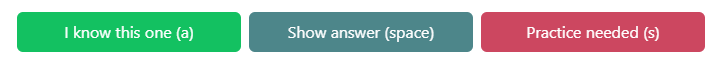

#### Telefon

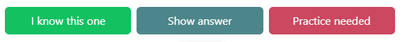

<details>

<summary>
Visa kod för knappar
</summary>

```js
// Retunerar bool beroende på screenwidht
const isMobile = () => {
  return window.innerWidth < 768;
};

// Sätter text beroende på enhet
const correctButtonText = isMobile()
  ? "I know this one"
  : "I know this one (a)";
const practiceButtonText = isMobile()
  ? "Practice needed"
  : "Practice needed (s)";
const showAnswerText = isMobile() ? "Show answer" : "Show answer (space)";
const showQuestionText = isMobile() ? "Show question" : "Show question (space)";
let deckId = route.params.deckId;

<template>
  <button>{{ correctButtonText }}</button>
  <button>{{ practiceButtonText }}</button>
  /.../
</template>;
```

</details>

---

### Startsida rubrik

Efter användartest insåg jag att det behövs vara mer självklart att användaren faktiskt befinner sig på en flashcard sida, så lade till rubriken 'Your flashcard collection'

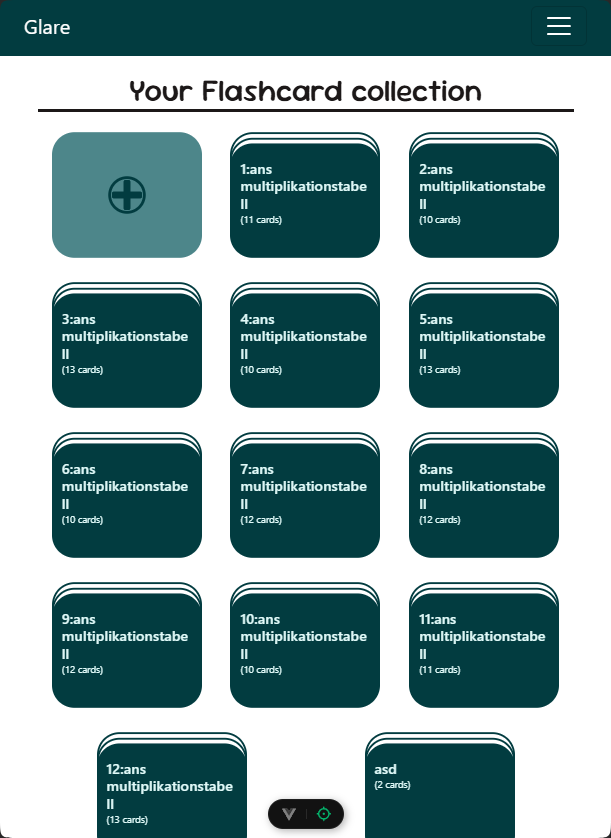

---

### Upp till 3x practice försök

Användaren vill såklart lära sig sina flashcards, så jag lade till funktionalliteten att om man inte kan ett kort så läggs det till i slutet av leken upp till 2gånger, så man totalt får "misslyckas" 3x gånger. Observera den annorlunda stilsättningen på "plupparna" som dyker upp när användaren trycker "need practice"

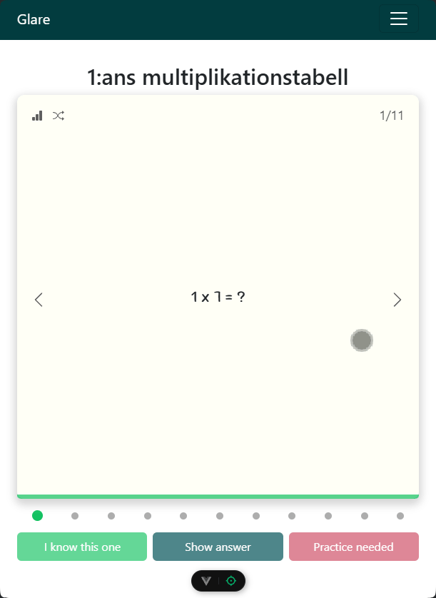

<details>
<summary>
Visa kod för CardView.vue
</summary>
När ett kort markeras som "practice" skapas ett kort som får isClone=true
<br>
detta för att sen kunna radera bort alla clon kort vid exporteringen till statistiken
<br>
koden innut i //--3x Fu.. är ny för denna funktionallitet

```js
function markAsPractice(card) {
  if (!card.hasAnswer) {
    //---- 3x Funktionallitet --- --- --- --- --- --- --- --- ---
    const copy = JSON.parse(JSON.stringify(card));
    copy.isClone = true;

    // Kollar att längden på tillagda specifikt kort inte överstiger 3, isåfall lägg
    // kopia i slutet av leken
    if (
      currentDeck.value.cards.filter((card) => card.id === copy.id).length <
      maxPracticeRepeat
    ) {
      currentDeck.value.cards.push(copy);
    }
    //---- 3x Funktionallitet --- --- --- --- --- --- --- --- ---
    card.hasAnswer = true;
    card.needsPractice = true;
  }
  if (allIsAnswered()) {
    showAlert.value = true;
  }
}
```

Tack vare att jag gett klonerna isClone=true kan jag lätt filtrera bort dom innan
<br>
exporten och även ta bort klonerna från currentDeck, så den inte fylls med mängder av
<br>
kloner på sikt.

```js
/**
 * Push current session to decks session
 * */
function exportDeckToStats() {
  // Sparar alla kort som inte är kloner
  const cardsCopy = JSON.parse(
    JSON.stringify(currentDeck.value.cards.filter((card) => !card.isClone))
  );
  // Exporterar session
  currentDeck.value.stats.sessions.push(cardsCopy);
  flashcard.updateStats(currentDeck.value);
  // Tar bort de tillagda klonerna från korlekens ursprungliga kort
  currentDeck.value.cards = currentDeck.value.cards.filter(
    (card) => !card.isClone
  );
  // Nollställer kortens värden
  currentDeck.value.cards.forEach((card) => (card.hasAnswer = false));
  showAlert.value = false;
}
```

tack vare att klonerna har eget atribut kan jag även utöka min gamla dotStyle
<br>
för att tillge klonerna egna stilsättningar.

```js
// Dots under flashcards
function dotStyle(currentCard) {
  const cardIndex = 1 + currentDeck.value.cards.indexOf(currentCard);
  let styleSettings = "dot ";
  watchEffect(() => {
    const cardNr = parseInt(route.params.cardNr);
    if (cardIndex === cardNr) {
      styleSettings += "current ";
    }
  });
  if (currentCard.hasAnswer && !currentCard.needsPractice) {
    styleSettings += "correct ";
  } else if (currentCard.hasAnswer && currentCard.needsPractice) {
    styleSettings += "wrong ";
  }
  // Lägger till class "clone" till 'dot' diven
  if (currentCard.isClone) {
    styleSettings += "clone ";
  }
  return styleSettings;
}
```

clone css

```css
.clone {
  opacity: 0.5;
  border: solid 2px var(--grey);
}
```

</details>

---

## 10/03-25

### Flip card med mus pekaren

Under användartesterna märkte jag att många ville trycka på korten i förväntan på att något skulle hända. Inget hände då för vi hade inte implementerat funktionalliteten. Men med en enkel @click="toggleAnswer" implementerades den funktionalliteten.
<br>
Känns även schysst mot användaren att kunna snegla på svaret för det kort man har svårast för på statistik sidan.


<details>
<summary> Visa kod för: src/view/CardView.vue och src/compoments/FlashCard.vue</summary>

### ToggleAnswer

Eftersom vi har en toggleAnswer function i CardView kan vi med emit skicka en signal från
<br> FlashCard.vue som signalerar att kortet ska byta sida

```js

//  Script CardView.vue
function toggleAnswer() {
  hideAnswer.value = !hideAnswer.value;
}
// Template CardView.vue
<FlashCard
  @on-deck-update="updateDeck"
  :hide-answer="hideAnswer"
  @toggle-answer="toggleAnswer"
  @on-reset-answer="resetAnswer"
  @mark-as-correct="markAsCorrect"
  @mark-as-practice="markAsPractice"
/>

// -----------------------------------

// Script FlashCard.vue
function toggleAnswer() {
  emit("toggle-answer");
}

// Template FlashCard.vue
<div
  v-if="hideAnswer"
  class="flashcard-content"
  id="front"
  @click="toggleAnswer">
  {{ currentCard.question }}
</div>

<div v-else class="flashcard-content" id="back" @click="toggleAnswer">
  {{ currentCard.answer }}
</div>
```

</details>

---

# Sammanfattning

Jag har lärt mig att det underlättar att reducera mängden komponenter ifall man bygger funktionallitet där saker och ting komminucerar mycket med varrandra. Å andra sidan, om man använder pinia så kan man komma runt custom events och props när det kommer till komponent kommunikation.
<br>
<br>
En stor utmaning har varit att hitta gemensamma lösningar med gruppen. Jag upplevde att det blir lätt Frankenstein lösningar, där man klipper och klistrar tills det funkar, utan att följa ett och samma mönster. Lösningen på det tror jag är en kombination av programmerings erfarenhet och tydlig kommunikation. Största utmaningen blir när två individer påstår sig vara den som sitter på den bästa lösningen, då hade nog bästa scenariot varit att ha en senior som kan lyssna in båda förslagen och sedan ta ett beslut som alla får vika sig för.
<br>
<br>
Det har varit otroligt lärorikt och jag vågar påstå att jag har god förståelse för hur VUE ramverk fungerar och jag ser möjligheterna i hur ramverket underlättar arbetet i hemsidobyggandet.
<br>
<br>
Tack för att du läste dig såhär långt.

<details>
<summary>Klicka för att se kod:</summary>

```js
function isUserAHero() {
  if (userMadeItThisFar) {
    return true;
  }
  return false;
}
```

</details>
